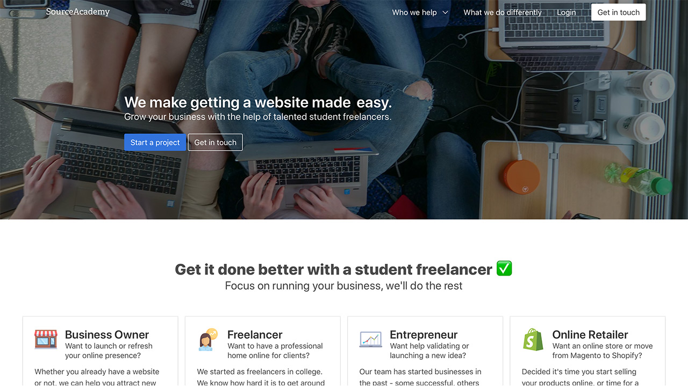

I sometimes find it hard to put stuff out there.

It rarely feels finished. It could always be more polished. It could always be better.

I’ve been running a business for a little over a year now called SourceAcademy. I've told people about it in person and at different events (like the GSEA) but I’ve never really put it out there online. This is me finally forcing myself to do that.

But first a bit of background.

Humble beginnings
I had been tinkering around with learning to make websites for a while but it wasn’t until I started a social enterprise with some talented friends that I had a real reason to make a website. Ultan, Ruben and Calvin made us a brilliant website for Cork Cares and I learned a lot from them.

Later on I was working with my friend Darragh, helping him market his über successful iPhone repair business when I suggested I make a website and somehow he agreed for me to make my first ever paid (!) website for Shattered.ie.

People in our coworking space Plus10 started asking me if I made websites. The honest answer probably should have been no but I said yes. I started working with fantastic clients like Holly, Erin, and Finbarr and all of a sudden I accidentally became a web developer.

An idea
Things were going well - some light website work was helping my cashflow as a cash-strapped student as well as making some great new friends. One day while I was studying for exams, Erin came back looking for a small bit of work done. I didn’t have time but instead of saying no I asked one of my friends from Cork Cares, Ultan, if he could do it.

Ultan said absolutely and we started working together as Jiff.ie (websites done in a jiffy… get it?). I knew that students made good freelancers because they are creative but inexperienced and they can afford to work for less than a ‘grown up’ freelancer. Freelancing was an ideal college job for us because we were getting paid to learn and develop our skills, get experience, and grow a network working whatever hours we wanted.

I started to think there might be a way to get more jobs for student freelancers and provide access to affordable talent for businesses…

Introducing SourceAcademy
SourceAcademy became my answer to this. The idea was to build a platform where businesses/individuals who needed creative help like web development, graphic design, videography etc. could go and view a list of student freelancers with their portfolios and prices.

I sat on the idea for a few months until I went to Startup Weekend Galway and pitched the idea on a whim. A lovely team of people helped me on the idea over the weekend and SourceAcademy got its first two customers - two people who were willing to take a gamble - DC Cahalane and Mick O’Brien.

Myself and our extremely talented team of freelancers (and now employees too (!)) have worked with some fantastic customers over the past year or so. I’ve made lots of mistakes, sometimes failed to deliver what I said I would but always tried to learn and improve. To all our customers so far - thank you for giving us a chance.

It’s been a great journey so far with the highlight definitely being competing in the semi-finals of the Global Student Entrepreneur Awards in Toronto (which you can read about here).

The idea has developed a lot since then and now my vision for SourceAcademy is for it to be the easiest way for someone to get creative digital help, focusing on websites to begin with.

In my next post I’ll explain exactly how I’m planning on doing that.

Take a look at the site, send me a message to let me know what you think and if you/someone you know needs a website made - say hi 😉
