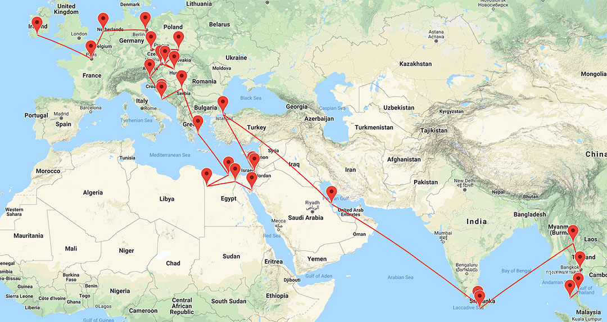

It’s been 71 days since I’ve been home. I’ve visited 27 towns and cities in 18 countries across Europe, Africa, the Middle East, and Asia.

I’ve spent the past few months exploring new places, catching up with friends and making new ones. I’ve been to countries observing four of the five major world religions. I’ve visited ancient wonders in Greece, ridden a camel to the Great Pyramids of Giza, I’ve lost my wallet in Bangkok, experienced welcome like no other in Bahrain, and I’ve gotten food poisoning at least three times, just to list a few.

I’ve taken over 1000 photos, over 200GB of videos, bought a drone in Vienna, and I’ve been working too. I’ve been building sites and helping clients from Ireland improve their online presence with the help of some talented freelancers. I’ve incorporated a company in Ireland, and in Delaware, and I've hired two actual employees - like with employment contracts and paying tax and everything. But more on that in my next post.

Finding the balance between having fun and getting work done has been tough at times but overall it’s been a blast.

*The trip so far.*

I’m travelling for a few reasons - 1) to blow off a bit of steam after finishing my degree, 2) to have a bit of fun with friends who are moving away, 3) to catch up with friends around the world, and 4) to experience and learn new things.

I’ve come to think over the past few years that when you put yourself in situations with interesting people in interesting places, you learn and experience things you would never have otherwise.

I believe we fundamentally are the average result of all our experiences, biases and decisions - this unpredictable but deterministic sum of everything that has led us to where we are today. For this reason I think an incredibly necessary driver of our growth as people is to go out there, meet new people, see different cultures, religions, and traditions and keep an open mind while doing so.

We only see such a narrow slice of what the world has to offer and I think it’s important to see as much as we can while we can.

That’s why I’m travelling. That’s why I’m heading east until I get back home. I don’t know where exactly I’m going next or when I’ll be home - and that’s what excites me.

For me, there no greater feeling of freedom than booking a one-way flight.

See you soon. 👋🏻

PS: Special thanks to my mum for being my proofreader and bailing me out along the way. I promise I'll be home soon Mum.
